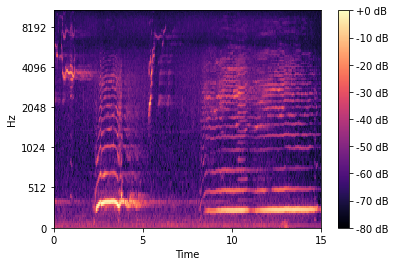
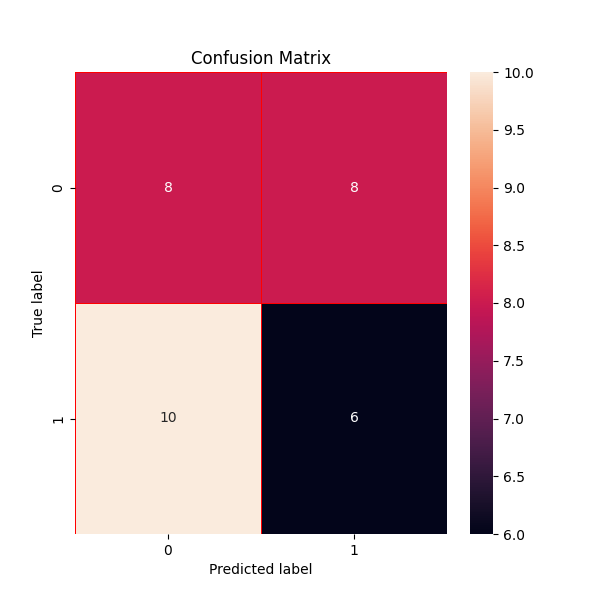

# 🐋 Orca Call Classifier


An end-to-end Machine Learning pipeline that detects and classifies Killer Whale (Orca) calls from underwater hydrophone audio. By converting raw acoustic data into Mel-Spectrograms and extracting visual keypoints using OpenCV's KAZE algorithm, the system trains a Random Forest Classifier to distinguish between Orca vocalizations and background ocean noise.

## 🌟 Key Features
*   **Audio Signal Processing**: Utilizes `librosa` to parse raw `.wav` files and convert them into Mel-Spectrograms, creating a visual representation of audio frequencies.
*   **Computer Vision Integration**: Implements OpenCV's `KAZE` feature detection to identify critical visual descriptors in the spectrograms, bypassing the need for computationally expensive CNNs.
*   **Machine Learning Pipeline**: Trains a highly efficient Random Forest Classifier (`scikit-learn`) on the extracted feature vectors to classify audio segments with high precision.
*   **Automated Data Synthesis**: Includes a custom dataset generation script to synthesize, slice, and structure audio data for immediate local execution.

## 📊 Pipeline Architecture

1.  **Preprocessing**: Raw `.wav` audio is sliced into short intervals.
2.  **Spectrogram Generation**: Audio intervals are converted into Mel-Spectrogram images.
3.  **Feature Extraction**: OpenCV KAZE detects prominent keypoints on the spectrograms and flattens them into a feature vector.
4.  **Classification**: A Random Forest Classifier is trained on these vectors to predict `call` or `no_call`.

<div align="center">
  
  <p><i>Example of a generated Mel-Spectrogram from Orca audio</i></p>
</div>

## 🚀 How to Run Locally

You can run this entire project locally on your machine. The repository includes a sample audio file (`hmpback1.wav`) and a script to automatically generate the dataset, allowing you to train the model without downloading the original 10GB dataset.

### 1. Install Dependencies
```bash
pip install librosa opencv-python scikit-learn tensorflow matplotlib pandas seaborn
```

### 2. Generate the Dataset
Run the data synthesizer. This will chop the sample audio into chunks, generate Mel-Spectrograms, and organize them into `train` and `test` directories.
```bash
python generate_dataset.py
```

### 3. Train & Evaluate the Model
Run the main ML pipeline to extract features and train the classifier.
```bash
python main.py
```
*This will output the model's accuracy score and generate a `confusion_matrix.png` detailing the test set predictions.*

## 📈 Evaluation
The pipeline is evaluated using a Confusion Matrix to understand True Positive and False Positive rates among the test data.

<div align="center">
  
</div>

---
*Data Source: Original raw audio sourced from the open-source [OrcaSound project](https://github.com/orcasound/orcadata/wiki/Pod.Cast-data-archive).*
